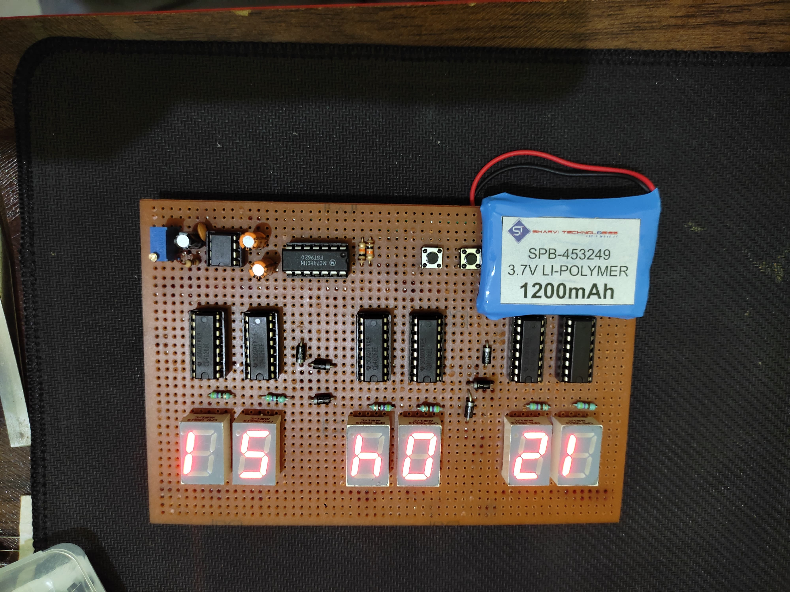
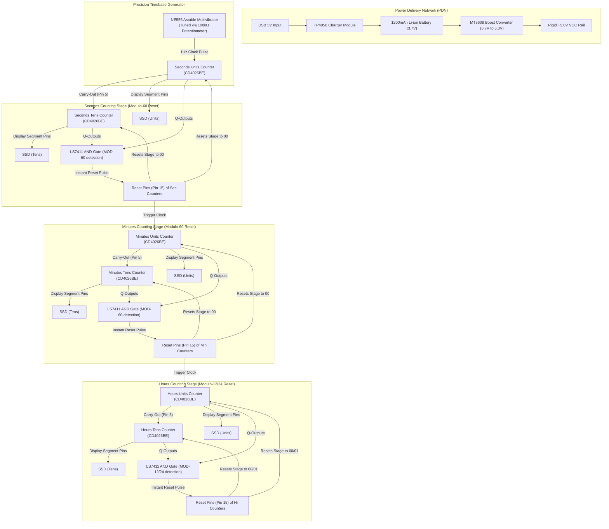

# 🕐 Discrete Logic Digital Clock (Zero-Microcontroller)

> A 6-digit digital hardware clock built entirely from discrete CMOS logic ICs, featuring modulo-60 and modulo-12/24 reset cascades, an astable 555-timer timebase, and an integrated lithium-ion power delivery network—all hand-soldered via high-density point-to-point wiring on a single perfboard.

---

## 📝 Project Specifications & Context

*   **Author:** Balaji Rayudu S
*   **Technical Domain:** Discrete Digital Electronics & Logic Design
*   **Design Objective:** To design and implement a standalone 12-hour/24-hour digital clock system that accurately tracks and displays time in HH:MM:SS format using discrete logic ICs, with zero microcontrollers or programmable code.

---

## ⚡ Key Highlights

*   **100% Microcontroller-Free:** Timekeeping, counting, decoding, and display driving are handled purely by hardware logic gates and decade counters. No software, no firmware, no compilation.
*   **Decade Counter Daisy-Chaining:** Asynchronously cascaded CMOS decade counters with integrated 7-segment display drivers (**CD4026BE**) to drive six independent common-cathode displays.
*   **Modulo Reset Logic:** Custom hardwired analog reset loops using discrete three-input AND gates (**LS7411**) to trigger instantaneous resets at `59s -> 00s` (Seconds) and `59m -> 00m` (Minutes), simultaneously clocking the subsequent stages.
*   **Integrated Power Network:** Standalone, rechargeable system utilizing a **1200mAh Li-ion battery**, a **TP4056** USB charging module, and a high-efficiency **3.7V to 5V boost converter** to supply the CMOS ICs and LED displays.
*   **High-Density Point-to-Point Fabrication:** Highly complex, manual routing of over a hundred logical carry-out, reset, segment-driver, and power lines on a single double-sided perfboard.

---

## 🏗️ System Architecture & Logic Flow

---

## 🔧 Component Specifications

| Component | Quantity | Role | Part Number / Reference |
|-----------|:--------:|------|-------------------------|
| **Decade Counter / Decoder** | 6 | Counts pulses & outputs 7-segment lines | CD4026BE |
| **3-Input AND Gate** | 1 | Manages MOD-60 and MOD-12/24 reset logic | LS7411 |
| **Astable Timer** | 1 | Generates the primary 1Hz clock signal | NE555 |
| **7-Segment Display** | 6 | Visual representation of digits (Red) | Common Cathode 0.56" |
| **Resistors (Display Guard)**| 8 | Limits current to display segments | 470 Ω |
| **Resistor** | 1 | NE555 timing pull-up | 1 kΩ |
| **Potentiometer** | 1 | Fine-tuning the 1Hz timebase frequency | 100 kΩ Multi-turn |
| **Capacitors** | 2 | Timing (10µF) and debouncing/decoupling (100nF)| 10µF electrolytic / 100nF ceramic |
| **Battery Charger** | 1 | USB Li-ion charging module | TP4056 |
| **Step-Up Converter** | 1 | Boosts battery 3.7V to stable system 5V | MT3608 (3.7 to 5V converter) |
| **Battery Cell** | 1 | Standalone power source | 3.7V Li-ion 1200mAh |

---

## 🧠 Hardware Reset & Clocking Logic

The clock relies on a cascade of **CD4026BE** ICs (Decade Counter/Dividers with Decoded 7-Segment Outputs). The logic loop operates as follows:

### 1. The 1Hz Timebase
*   A **NE555 timer IC** is configured in **astable mode**, tuned using a 100kΩ multi-turn potentiometer, 1kΩ resistor, and 10µF capacitor to output a stable **1Hz square wave**.
*   This 1Hz pulse is fed directly into the Clock pin (Pin 1) of the **Seconds (Units)** counter.

### 2. Seconds Stage Cascade & Modulo-60 Reset
*   **Units to Tens Carry:** As the Seconds (Units) counter increments from `9` to `0`, its carry-out pin (Pin 5) transitions from HIGH to LOW, clocking the Seconds (Tens) counter.
*   **Modulo-60 Reset Loop:** 
    1.  The units counter cycles `0-9`. The tens counter cycles `0-5`.
    2.  When the tens counter transitions to `6`, the **LS7411 3-Input AND Gate** detects the combination of specific outputs that identify a count of 60.
    3.  The AND gate output immediately pulses the **Reset pins (Pin 15)** of *both* the Seconds (Units) and Seconds (Tens) ICs, bringing the display instantly back to `00`.
    4.  Simultaneously, this reset pulse serves as the **Clock pulse** for the subsequent **Minutes (Units)** IC.

### 3. Minutes & Hours Cascades
*   The **Minutes** stage uses the exact same Modulo-60 hardwired reset cascade to reset itself and clock the **Hours (Units)** stage.
*   The **Hours** stage is configured to reset after reaching `12` (or `24` depending on physical jumper configuration). The LS7411 AND gate monitors the transition of the Hours (Tens) to `1` or `2` and Hours (Units) to `2` or `4` respectively, pulling the reset lines HIGH to cycle back to `00` or `01`.

---

## 🛠️ Fabrication & Soldering Complexity

Because the CD4026BE integrates the counter and display driver in a single package, there is no high-level bus architecture. Every single segment line must be physically routed:
*   **Display Wiring:** 6 displays × 7 segments = **42 independent cathode lines** hand-routed from IC pins to display sockets.
*   **Clocking & Reset Bus:** Daisy-chain carry lines, physical AND gate inputs, and global/local reset lines routed using point-to-point hookup wire.
*   **Power Distribution:** Parallel 5V and Ground rails distributed to all 6 counters, 6 displays, and 3 logic/timer ICs.
*   **Physical Layout:** Built on a single high-quality double-sided perfboard, demanding absolute precision to prevent solder bridges or cold joints.

---

## 🔬 Troubleshooting, Debugging & Resolutions

During design implementation and hardware testing on the perfboard, several critical engineering issues were encountered and resolved:

### 1. Modulo-60 Counter Over-Run
*   **Problem:** The seconds and minutes segments were counting up to `99` and then rolling over to `00`, completely failing the Modulo-60 reset logic.
*   **Cause:** The 1Hz clock pulse frequency from the NE555 was initially tuned too high during early tests, causing the transient reset pulse to be missed. A dysfunctional AND gate within the LS7411 was also failing to pull the reset lines HIGH.
*   **Solution:** Fine-tuned the 100kΩ potentiometer to lower the timing frequency to a true 1Hz and replaced the faulty LS7411 AND gate IC.

### 2. Failure of the Hours Segment to Cascade
*   **Problem:** The Hours display would not increment when the Minutes segment rolled over from `59` to `00`.
*   **Cause:** Internal logic error inside the cascaded AND gate section which failed to trigger a carry-out pulse to the Hours stage under active operation.
*   **Solution:** Swapped the logic routing to an unused gate within the triple 3-input LS7411 AND gate IC, restoring the clock pulse bridge to the Hours (Units) pin.

### 3. Invalid Display Outputs and Logic Corruption
*   **Problem:** The 7-segment displays lit up with garbled, non-decimal segments and random decimal noise.
*   **Cause:** A slightly high voltage supply rail (exceeding 5.5V) was causing logic errors and gate corruption within the sensitive CMOS ICs.
*   **Solution:** Lowered the input voltage and stabilized it using a dedicated 3.7V-to-5V step-up boost converter to ensure a rigid 5.0V VCC rail.

### 4. Solder Bridging and Cold Joints
*   **Problem:** High-density trace routing on the perfboard led to short circuits and flaky connections.
*   **Cause:** The manual, dense point-to-point routing of 42 display segment lines and carry pins led to high thermal load and close proximity soldering.
*   **Solution:** Cleaned bridges using desoldering wick and re-soldered cold joints at a higher iron temperature to ensure clean, durable connections.

### 5. Hours Button-Set RC Circuit Failure
*   **Problem:** Unable to set the hours manually using a debounced push button like the minutes segment.
*   **Cause:** The RC debounce filter circuit was not discharging properly, preventing a clean transition edge.
*   **Solution:** Decoupled the set-hours button line and relied on direct clock transitions or reset sweeps.

---

## 👤 Author
**Balaji Rayudu S**  
B.Tech Electronics & Computers Engineering, Semester IV  
Amrita Vishwa Vidyapeetham, Bengaluru  

